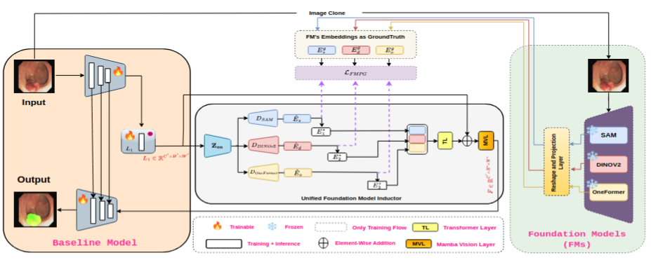
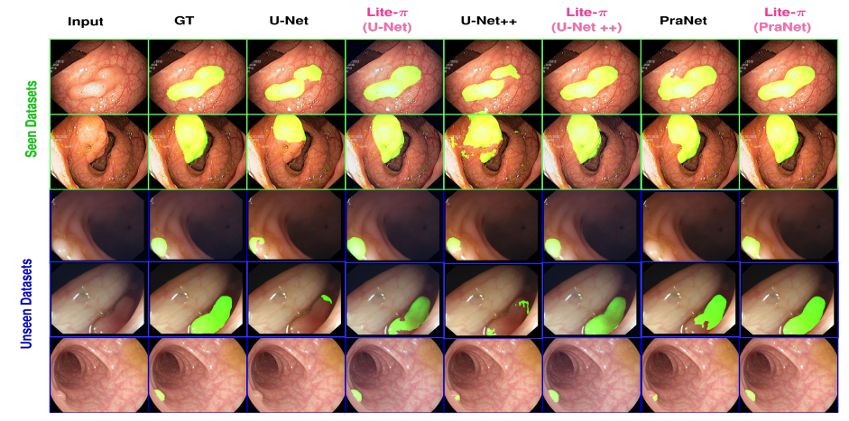

# Lite-π
## Induce to Empower: Improving Lightweight Baselines via Foundation Model Induction for Generalized Polyp Segmentation

<p align="center">
  
</p>

<p align="center">
  <b>🚀 Empowering lightweight segmentation networks through foundation model induction for robust cross-dataset generalization.</b>
</p>

---

## 📖 Introduction

Automated polyp segmentation remains a challenging task due to substantial appearance variations, indistinct polyp boundaries, and significant domain shifts across datasets.

While Vision Foundation Models (VFMs), such as **SAM**, **DINOv2**, and **OneFormer**, demonstrate remarkable generalization capabilities, their direct deployment for polyp segmentation is hindered by high computational demands and limited domain-specific annotations. Conversely, lightweight segmentation models, including **U-Net**, **U-Net++**, and **PraNet**, are computationally efficient but often suffer from poor cross-dataset generalization due to limited representational capacity.

To address this gap, we propose **Lite-π**, a novel **Foundation Model Induction (FMI)** framework that empowers lightweight segmentation baselines by inducing complementary semantic and structural knowledge from multiple foundation models.

---

## 💡 Our Approach: Lite-π

Lite-π consists of three key components:

- **FM-Specific Prototype Generation:** Extracts representative semantic priors from multiple foundation models.
- **Reconstruction-Based Semantic Alignment:** Aligns lightweight features with the induced foundation model representations.
- **Transformer-Based Fusion:** Preserves complementary semantic and boundary information while highlighting polyp-relevant representations.


## ✨ Highlights

- ✅ Novel Foundation Model Induction framework.
- ✅ Enhances lightweight segmentation models without expensive fine-tuning.
- ✅ Leverages complementary knowledge from multiple vision foundation models.
- ✅ Superior cross-dataset generalization.
- ✅ Minimal computational overhead.
- ✅ Suitable for real-time clinical deployment.

---

## 📊 Results

### Seen Datasets
- Kvasir-SEG
- CVC-ClinicDB

<p align="center">
  
</p>

### Unseen Datasets
- ColonDB
- CVC-300
- ETIS-LaribPolypDB
---

## 📁 Dataset Preparation

```text
datasets/
├── Kvasir-SEG/
├── CVC-ClinicDB/
├── ColonDB/
├── CVC-300/
└── ETIS-LaribPolypDB/
```
---


## 🙏 If you like our work please cite....
